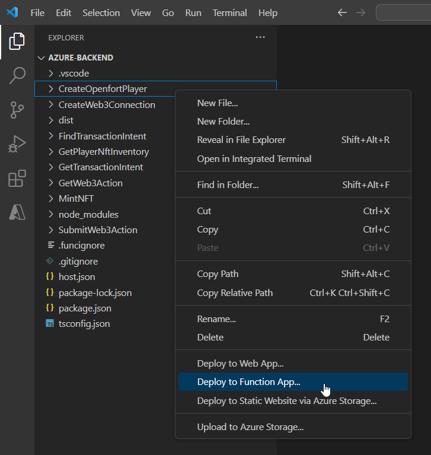
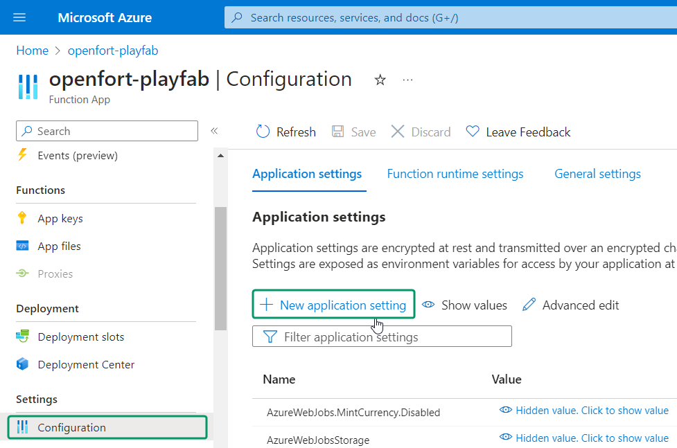
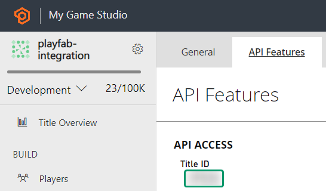
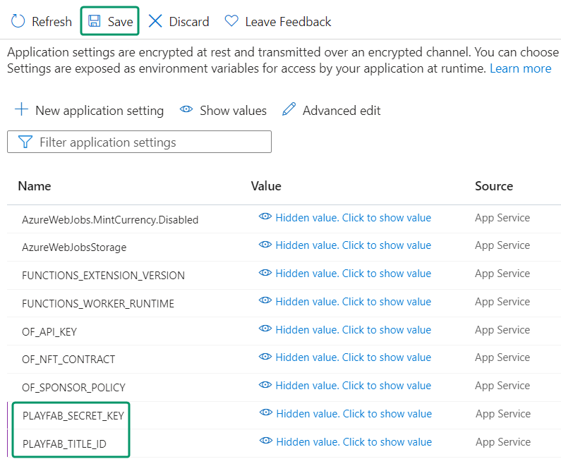
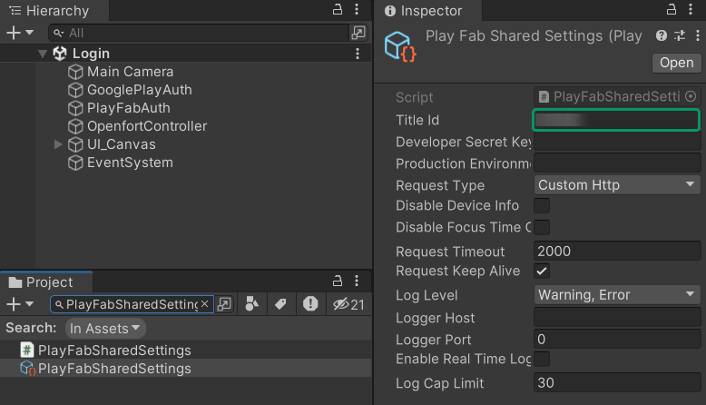

# Openfort-PlayFab Integration in Unity

## Overview
[PlayFab](https://playfab.com/) is a backend service provided by Microsoft for game developers, offering tools for live game management, all powered by Azure's cloud infrastructure.

By integrating the [Openfort SDK](https://github.com/openfort-xyz/openfort-node) into Azure Functions, we establish a seamless connection to PlayFab. Unity clients using the PlayFab Unity SDK can tap into these functions, accessing the full range of Openfort features within the game environment.

In this sample we especially dig into [Web3 Connections API features](https://www.openfort.xyz/docs/reference/api/create-a-web3-connection-object), being able to connect with an NFT marketplace - like [OpenSea](https://opensea.io/) - and list your NFTs from the game frictionlessly.

## Application Workflow


## Prerequisites
+ [Create a PlayFab account and title](https://learn.microsoft.com/en-us/gaming/playfab/gamemanager/quickstart)
+ Set up your Azure development environment:
    + [Configure your environment](https://learn.microsoft.com/en-us/azure/azure-functions/create-first-function-vs-code-node?pivots=nodejs-model-v4#configure-your-environment)
    + [Sign in to Azure](https://learn.microsoft.com/en-us/azure/azure-functions/create-first-function-vs-code-node?pivots=nodejs-model-v4#sign-in-to-azure)
    + [Create a function app](https://learn.microsoft.com/en-us/azure/azure-functions/create-first-function-vs-code-node?pivots=nodejs-model-v4#create-the-function-app-in-azure)
+ [Sign in to dashboard.openfort.xyz](http://dashboard.openfort.xyz) and create a new project
+ Download or clone the [sample project](https://github.com/openfort-xyz/playfab-unity-sample): 
    + Open [unity-client](https://github.com/openfort-xyz/playfab-unity-sample/tree/main/unity-client) with Unity
    + Open [azure-backend](https://github.com/openfort-xyz/playfab-unity-sample/tree/main/azure-backend) with VS Code

## Set up Openfort

1. #### [Add a Contract](https://dashboard.openfort.xyz/assets/new)
   This sample requires a contract to run. We use [0x51216BFCf37A1D2002A9F3290fe5037C744a6438](https://sepolia.etherscan.io/address/0x51216bfcf37a1d2002a9f3290fe5037c744a6438) (NFT contract deployed in 11155111 Sepolia). You can use this for the guide:

   

2. #### [Add a Policy](https://dashboard.openfort.xyz/policies/new)
   We aim to cover gas fees for users. Set a new gas policy:

   

   Now, add a rule so our contract uses this policy:

   

## Deploy Azure Backend
Open [azure-backend](https://github.com/openfort-xyz/playfab-unity-sample/tree/main/azure-backend) with VS Code and sign in to Azure:


Ensure your Function App (here, it's "openfort-playfab") is listed:


In the terminal, run:
```
npm install
```

In the explorer, right-click on a function and select ***Deploy to Function App***:



Next, choose your Function App:


Then, click on ***Deploy***:


Navigate to your [Azure Portal](https://portal.azure.com/#home) and open your Function App. You should see all the functions listed:


Click on any function and select ***Get Function Url***:


Subsequently, add this URL (along with all others) to PlayFab to enable access to our Azure Functions from within PlayFab.

## Set up PlayFab Title

1. #### Register Azure Functions
    Visit the [PlayFab developer dashboard](https://developer.playfab.com/), choose your title, and click on ***Automation***:

    

    Our functions are already registered. To do the same, click ***Register function*** and provide the function name along with its URL:

    

    Repeat this for all deployed functions.

## Set up Azure Backend

Our Azure backend requires environment variables from both PlayFab and Openfort. Let's configure them.

1. #### Add Openfort Environment Variables
    - Navigate to the [Azure Portal](https://portal.azure.com/#home) and select your Function App.
    - Under ***Configuration***, click ***New application setting***:
      
      

    - Provide the following details:
      + Name: `OF_API_KEY`
      + Value: [Retrieve the **Secret key**](https://dashboard.openfort.xyz/apikeys)

    - Add another application setting:
      + Name: `OF_NFT_CONTRACT`
      + Value: [Retrieve the **Contract API ID**](https://dashboard.openfort.xyz/assets)

    - And another:
      + Name: `OF_SPONSOR_POLICY`
      + Value: [Retrieve the **Policy API ID**](https://dashboard.openfort.xyz/policies)

    After adding these, your configuration panel should resemble the following. Click ***Save***:
    
    

2. #### Add PlayFab Environment Variables
    - Visit the [PlayFab developer dashboard](https://developer.playfab.com/), select your title, and navigate to ***Settings wheel --> Title settings***:

      

    - In the ***API Features*** section, copy your ***Title ID***:

      

    - Under ***Secret Keys***, note down your ***Secret key***:

      

    - Return to the [Azure Portal](https://portal.azure.com/#home) and choose your Function App.
    - Under ***Configuration***, select ***New application setting*** and input:
      + Name: `PLAYFAB_TITLE_ID`
      + Value: [Your Title ID]

    - Add another application setting:
      + Name: `PLAYFAB_SECRET_KEY`
      + Value: [Your Secret Key]

    Your configuration panel should now look like the following. Confirm your changes by clicking ***Save***:

    

## Set up Unity Client

This Unity sample project is already equipped with:
+ [PlayFab Unity SDK](https://github.com/PlayFab/UnitySDK)
+ [Google Play Games Unity Plugin (v11.01)](https://github.com/playgameservices/play-games-plugin-for-unity)

To begin, open [unity-client](https://github.com/openfort-xyz/playfab-unity-sample/tree/main/unity-client) with Unity:

1. #### Configure PlayFab SDK
    - Navigate to the ***Project*** tab.
    - Search for `PlayFabSharedSettings` and input your PlayFab ***Title ID***:

      

## Test in Editor

Play ***Login*** scene, opt for ***Register***, provide an email and password, then click ***Register*** again. This scene should appear:


Select ***Mint***. After a brief period, you should see a representation of your newly minted NFT:


In the [Openfort Players dashboard](https://dashboard.openfort.xyz/players), a new player entry should be visible. On selecting this player:


You'll notice that a `mint` transaction has been successfully processed:


Additionally, by choosing your **Sepolia Account** and viewing ***NFT Transfers***, the transaction is further confirmed:


In Unity, click on ***List NFTs***:


Go to [OpenSea](https://testnets.opensea.io/) and choose ***Login***:


Then select ***WalletConnect*** and click on the icon to copy the connection URL:


Back to Unity, paste the URL and choose ***Create***:


In OpenSea, a welcome panel will pop up. Choose ***Accept and sign***:


Go to your profile and you will find your NFT. Choose ***List for sale***:


Set a price and a duration and choose ***Complete listing***:


As your first NFT collection, you will need to approve it:


Back in Unity, select ***Approve***:


After a few seconds OpenSea will let you know the collection approval has been successful:


Now go back to Unity and ***Approve*** the listing:


Finally, in OpenSea you will see the confirmation of your listing:


## Conclusion

Upon completing the above steps, your Unity game will be fully integrated with Openfort and PlayFab, and able to list your NFTs to a marketplace directly from your game. Always remember to test every feature before deploying to guarantee a flawless player experience.

For a deeper understanding of the underlying processes, check out the [tutorial video](https://youtu.be/PHNodBmbEfA). 

## Get support
If you found a bug or want to suggest a new [feature/use case/sample], please [file an issue](../../issues).

If you have questions, or comments, or need help with code, we're here to help:
- on Twitter at https://twitter.com/openfortxyz
- on Discord: https://discord.com/invite/t7x7hwkJF4
- by email: support+youtube@openfort.xyz
